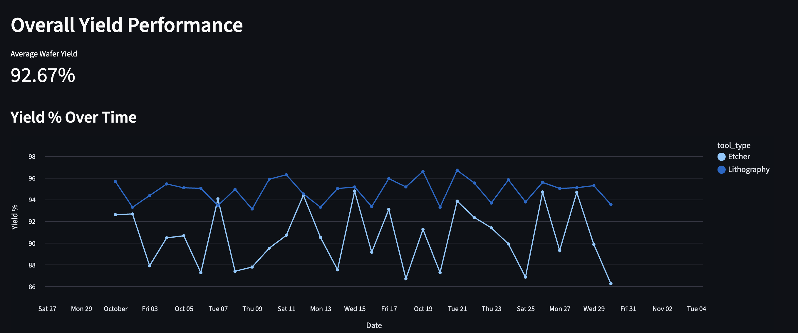

# Semiconductor Yield Analytics Dashboard 

This repository contains a **Streamlit dashboard** for monitoring and analyzing semiconductor wafer yield and process parameters.

---

## Features

- **Overall Yield Performance**: Tracks wafer yield over time.
- **Process Analysis (Etch)**: Visualizes etch process parameters (pressure, duration) vs yield.
- **Failure Analysis**: Identifies and counts failure reasons.

---

## Dashboard Screenshots

### 1. Overall Yield Performance


### 2. Etch Process Analysis


### 3. Failure Analysis


---

## How to Run Locally

1. Clone the repository:
```bash
git clone https://github.com/your-username/semiconductor-yield-platform.git
cd semiconductor-yield-platform/dashboard
